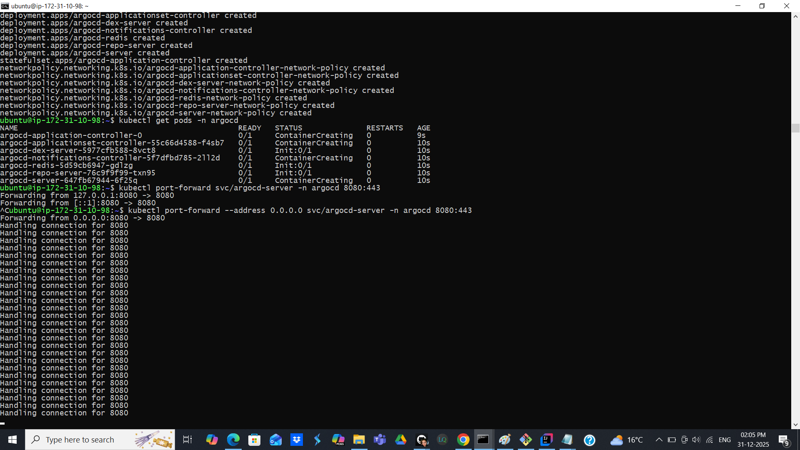

# Notification
Development and Deployment of Notification Service using Java, Kafka,Docker, Kubernates, Jenkins

# Setting up Minikube and Argo CD on AWS EC2 Ubuntu Instance

**Install Docker (Minikube needs it)**
sudo apt update
sudo apt install -y docker.io
sudo usermod -aG docker ubuntu
newgrp docker
docker ps

**Install kubectl**
curl -LO https://storage.googleapis.com/kubernetes-release/release/$(curl -s https://storage.googleapis.com/kubernetes-release/release/stable.txt)/bin/linux/amd64/kubectl
chmod +x kubectl
sudo mv kubectl /usr/local/bin/
kubectl version --client

**Install Minikube**
curl -LO https://storage.googleapis.com/minikube/releases/latest/minikube-linux-amd64
chmod +x minikube-linux-amd64
sudo mv minikube-linux-amd64 /usr/local/bin/minikube
minikube version

**Start Minikube**
minikube start \
--driver=docker \
--cpus=2 \
--memory=6000
kubectl get nodes

**Enable Ingress**
minikube addons enable ingress

**Install Argo CD on Minikube**
kubectl create namespace argocd
kubectl apply -n argocd \
-f https://raw.githubusercontent.com/argoproj/argo-cd/stable/manifests/install.yaml

kubectl get pods -n argocd

**Access Argo CD UI**
kubectl port-forward svc/argocd-server -n argocd 8080:443

https://<EC2-PUBLIC-IP>:8080

**Get admin password**
kubectl get secret argocd-initial-admin-secret \
-n argocd -o jsonpath="{.data.password}" | base64 -d

**Verify Kubernetes is READY**
kubectl get all -n argocd

**Argo CD Server Deployment**

